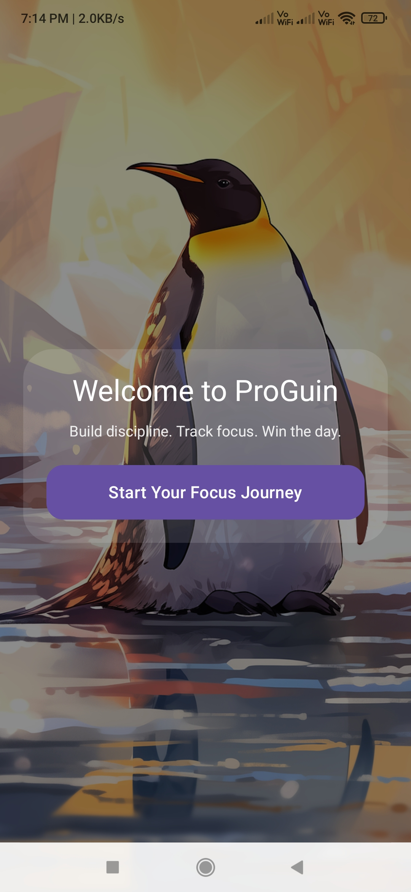
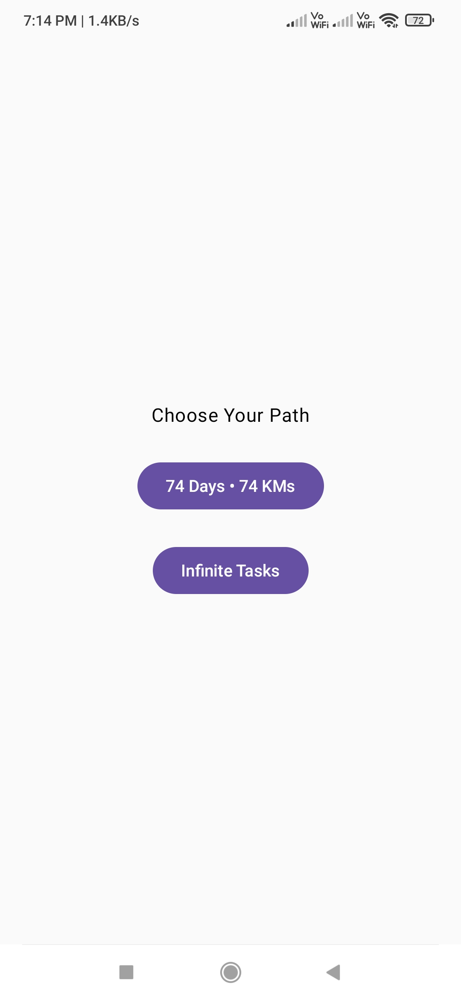
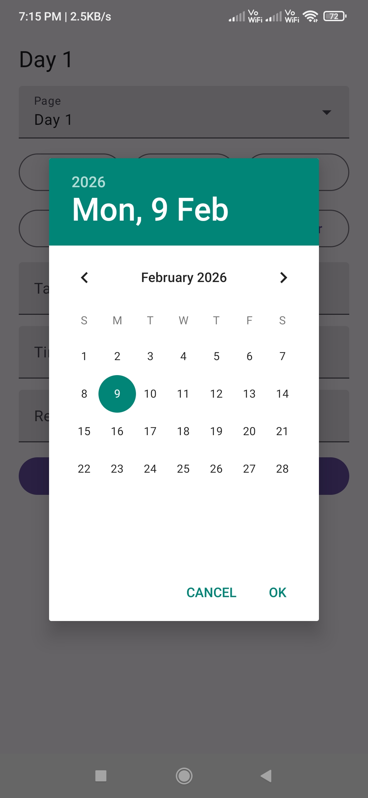
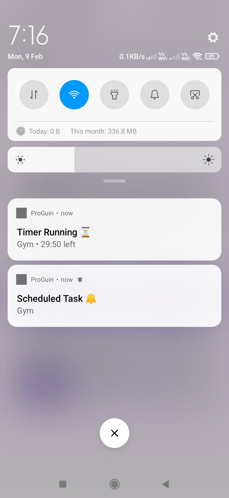

# ProGuin 🐧

[](https://github.com/Venkateshx7/ProGuin/graphs/contributors)
[](https://github.com/Venkateshx7/ProGuin/network/members)
[](https://github.com/Venkateshx7/ProGuin/stargazers)
[](https://github.com/Venkateshx7/ProGuin/issues)
[](https://github.com/Venkateshx7/ProGuin/blob/main/LICENSE)

<p align="center">
  
</p>

<p align="center">
  <b>Stay focused. Keep moving.</b><br/>
  Build discipline. Track focus. Win the day.
</p>

---

## 👤 Author

**Venkatesh D**  
Creator & Maintainer of ProGuin

---

# ✨ What is ProGuin?

ProGuin is a discipline-first productivity system.

It is not just a to-do app.  
It is a structured daily execution system designed to:

- Encourage consistency over motivation  
- Reward completion, not planning  
- Promote time-bound focus  
- Keep the system simple and practical  

ProGuin started as a Python CLI productivity tool and is now evolving into a full Android application.

This repository contains both versions.

---

# 📦 Project Structure

```
proguin/             → Python CLI version
proguin-android/     → Android App (Jetpack Compose)
assets/              → Screenshots & demo media
```

---

# 🖥 Python CLI Version

The original version of ProGuin.

### Features

- Multi-page daily task planning
- Optional timer for tasks
- Optional reward system
- Persistent JSON storage
- Mark tasks as done
- Remove tasks
- Clean interactive CLI menu

---

## 📸 CLI Screenshot

<p align="center">
  
</p>

---

## 🚀 Run the CLI

### Requirements

- Python 3.8+

### Run directly

```bash
python -m proguin.cli
```

### Or install locally

```bash
pip install -e .
proguin
```

---

# 📱 Android App (Jetpack Compose)

The next evolution of ProGuin.

Built using:

- Kotlin
- Jetpack Compose
- Notification system
- Local JSON storage
- Alarm & Timer system

---

## ✨ Android Features

- Welcome onboarding screen
- Choose productivity mode
- Create tasks with optional timer
- Schedule tasks with date & time
- Optional reward field
- Live timer notification
- Scheduled task notification
- Start / Delete / Done controls
- Clean minimal UI

---

## 📸 Android Screenshots

<p align="center">
  
  
  
  
</p>

---

# 🎥 Android Demo

A full demo video is available inside:

```
assets/Proguin_app_demo.mp4
```

Download and watch locally.

---

# 🛣 Roadmap

### 🔧 Current Focus

- Fix bugs and crashes
- Improve core functions
- Improve UI/UX polish
- Optimize performance

### 🚀 Future Vision

- Scale ProGuin to wider audience
- Expand ecosystem (CLI → Android → more)
- Advanced focus modules
- Habit systems
- Data insights
- Cloud sync (future concept)

---

# 🎯 Philosophy Behind ProGuin

- Discipline over motivation
- Start small, stay consistent
- Finish what you start
- Reward completion
- Remove distractions
- Daily execution > Big plans

---

# 🤝 Contributing

Contributions are welcome.

1. Fork the repository
2. Create your feature branch  
   `git checkout -b feature/AmazingFeature`
3. Commit your changes  
   `git commit -m "Add AmazingFeature"`
4. Push to branch  
   `git push origin feature/AmazingFeature`
5. Open a Pull Request

Please read `CONTRIBUTING.md` before submitting.

---

# 📄 License

MIT License

Distributed under the MIT License.

---

# ⭐ Support the Project

If you believe in disciplined productivity systems,  
consider giving this project a star ⭐

Every star motivates further development.
